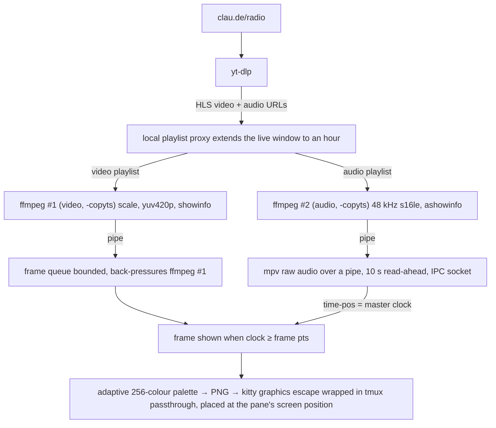

# claude-fm

claude-fm plays Claude FM, the lo-fi stream behind Claude Code's `/radio`
command, in a terminal pane. It draws the video with the kitty graphics
protocol and plays the audio through mpv. Inside tmux, the picture stays in its
pane through splits, zooms, window switches and resizes. The only controls are
pause, volume and jump to live.


## Requirements

| Tool     | Why                                                                     | Install (macOS)       |
| -------- | ----------------------------------------------------------------------- | --------------------- |
| terminal | kitty graphics protocol: kitty, ghostty, WezTerm, iTerm2 ≥ 3.5, Konsole |                       |
| Go 1.27+ | build                                                                   | `brew install go`     |
| yt-dlp   | resolve the live stream to HLS media URLs                               | `brew install yt-dlp` |
| ffmpeg   | decode video and audio                                                  | `brew install ffmpeg` |
| mpv      | audio output and the playback clock                                     | `brew install mpv`    |

claude-fm runs on macOS and Linux. On Linux, install the media tools with your
package manager. At start-up, claude-fm asks the terminal whether it supports
kitty graphics, so any terminal that answers the query works, such as kitty,
ghostty, iTerm2, Konsole and WezTerm.

Tmux is supported. Inside tmux, claude-fm enables `allow-passthrough` for its
own pane, turns on `focus-events` for the server and adds a
`session-window-changed` hook that tells its pane about window switches. If
`focus-events` was off before, claude-fm turns it back off on exit, and it
removes its hook entry.

## Install

Install with `go install` or from a checkout. Either way, the install directory
must be on your `PATH`. Start the player with `claude-fm`.

### With `go install`

```sh
go install github.com/v3ceban/claude-fm@latest
```

This puts the binary in `$(go env GOBIN)`, or in `$(go env GOPATH)/bin`
(usually `~/go/bin`) if `GOBIN` is unset. Run the same command again to update.

To uninstall, delete the binary from that directory:

```sh
rm "$(go env GOPATH)/bin/claude-fm"   # or "$(go env GOBIN)/claude-fm" if GOBIN is set
go clean -modcache                    # optional, deletes downloaded sources for every module
```

### From a checkout

```sh
git clone https://github.com/v3ceban/claude-fm.git
cd claude-fm
make install
```

This builds the binary and copies it to `~/.local/bin`. Pass `PREFIX` to
install somewhere else. For example, `make install PREFIX=/usr/local` puts it in
`/usr/local/bin`. To update, run `git pull` and then `make install` again.

To uninstall, run `make uninstall` with the same `PREFIX` you installed with.
`make clean` then deletes the build output from the checkout:

```sh
make uninstall
make clean
```

## Usage

```
claude-fm [flags]

-volume 100     volume 0-130
-fps 30         max frames per second to draw
-cell-px WxH    terminal cell size in pixels, if detection is wrong
-input FILE     play a local file or direct URL instead of Claude FM
-log FILE       write a debug log
-cookies NAME   if YouTube asks for a bot check, retry with this browser's cookies
```

### Controls

| Key              | Action                |
| ---------------- | --------------------- |
| `q`, `Esc`, `^C` | quit                  |
| `space`, `p`     | pause / resume        |
| `l`              | jump back to live     |
| `↑` / `↓`        | volume up / down by 5 |

Resuming continues from where you paused, as long as that point is still in the
live history, which goes back up to an hour (see "Live history" below). The
toast shows how far behind live you are, and `l` jumps back to live. After a
longer pause, resuming starts at live automatically.

There are no seek controls on purpose: claude-fm is a background tool, not a
media player, and a lo-fi stream has nowhere to seek to. Pausing covers short
breaks, and `l` brings you back to what the broadcast is playing now.

### "Sign in to confirm you're not a bot"

YouTube sometimes blocks anonymous requests from an IP address, and yt-dlp then
fails with this message. claude-fm stops retrying and asks you to restart with
`-cookies` and the name of a browser where you are signed in to YouTube, such
as `chrome`, `firefox`, `safari`, `brave` or `edge`. Any value that yt-dlp's
`--cookies-from-browser` accepts works, including `chrome:Profile 1`.

With `-cookies` set, claude-fm still tries anonymously first. It reads the
browser's cookies only after a bot check, then keeps using them for reconnects
until it exits. On macOS, Chromium-based browsers show a Keychain prompt before
yt-dlp can read their cookies, and Safari requires Full Disk Access for your
terminal. yt-dlp warns that YouTube may rate-limit an account whose cookies it
uses, so use a secondary account if you have one.

## Other Claude FM players

| Project                                                         | Shows                                             | Controls                      |
| --------------------------------------------------------------- | ------------------------------------------------- | ----------------------------- |
| [GithubAnant/claudefm](https://github.com/GithubAnant/claudefm) | a text dashboard, no video                        | pause, seek, volume           |
| [code-akram/cc-fm-mod](https://github.com/code-akram/cc-fm-mod) | a spectrum under the Claude Code prompt, no video | `/fm` commands in Claude Code |

If audio alone is enough, or you want seek controls or Claude Code
integration, give one of those projects a try.

## How it works



**Sync.** YouTube serves video and audio as separate HLS playlists that start
on different segments. Both ffmpeg processes run with `-copyts` to keep the
absolute timestamps, and `showinfo`/`ashowinfo` log the pts of every frame and
audio chunk. The player trims whichever stream starts earlier, feeds the PCM to
mpv, and polls mpv's `time-pos` 25 times a second. It draws each frame when the
smoothed clock reaches the frame's timestamp. Frames keep the stream's own
timing, and the player never inserts duplicates to fill gaps.

mpv buffers several seconds of audio ahead, so a slow terminal or a short network
drop doesn't interrupt the sound. The player drops late video frames instead.

**Live history.** The HLS playlist from yt-dlp lists only the last 30 s.
YouTube still serves older segments, and their URLs differ only by a sequence
number. The player runs a small HTTP server on localhost that polls the
upstream playlist and rewrites it to list up to an hour of segments, ending at
the live. It probes once at the start to find the oldest segment that still
exists. Both ffmpeg processes read this local playlist but fetch the media
segments directly from YouTube, so only playlist text passes through the proxy.

**Stalls.** A watchdog notices when the clock stops, a feed goes silent or
video runs far ahead of audio, and the player reconnects by itself, as it does
when ffmpeg exits. The watchdog is suspended while playback is paused.

**Picture.** The player picks the largest of 1280×720, 854×480, 640×360 and
426×240 that fits the pane's pixel size, and the terminal scales it the rest of
the way. The player reduces each frame to its 256 most used colours and encodes
it as a paletted PNG in about 10 ms. The stream's art is flat, so 256 colours
reproduce it exactly. Frames alternate between two kitty image ids, and drawing
a frame deletes the one before it, so old images don't build up in the
terminal. Inside tmux, the player places each frame at the pane's absolute
screen position, so other panes stay untouched, and hides the picture whenever
the pane is hidden. It learns about that from tmux focus events, from its
window hook when another pane is active, and from a 200 ms poll as a fallback.
It keeps the last frame and redraws it when the pane comes back, is resized,
or waits for a reconnect, so a paused picture never goes blank.

## Layout

```
main.go                CLI and presentation loop
internal/render/       adaptive quantizer, PNG frame encoder, toast labels
internal/pipeline/     ffmpeg and mpv session, frame and audio queues, A/V clock
internal/stream/       yt-dlp resolution, local HLS playlist proxy
internal/tty/          raw mode, graphics probe, tmux integration, kitty output, key input
```

## Development

```sh
make test-short   # unit tests
make test         # also runs the ffmpeg/mpv integration test on a generated clip
make lint         # go vet and gopls check, via go run if gopls is not installed
```

The tests don't use the network. The proxy tests run against a fake upstream
server on localhost. The pipeline test generates its own clip and skips itself
if ffmpeg or mpv is missing. Tests write only to temporary directories, which
Go deletes afterwards.

Two environment variables help with manual testing.
`CLAUDE_FM_FORCE_GRAPHICS=1` skips the terminal check, for example to run the
player headless in a detached tmux session while you watch its log.
`CLAUDE_FM_HLS="<video m3u8> <audio m3u8>"` skips yt-dlp and plays the given
live playlists through the normal live path, including the proxy.

## Notes

- Terminals embedded in other programs, such as Neovim's `:terminal`, VS Code and
  Emacs vterm, don't pass graphics through, so claude-fm won't start in them.
- The stream URL changes when the broadcast restarts, and media URLs expire after
  a few hours. In both cases the player resolves the stream again and reconnects.
