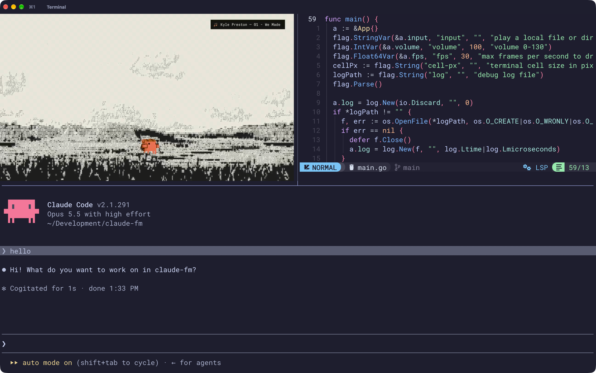

# claude-fm

Watch and listen to **Claude FM**, the lo-fi stream behind Claude Code's
`/radio` command, in a terminal pane. The video is drawn as real pixels, the
audio plays through mpv, and the picture follows the pane through tmux splits,
zooms, window switches and resizes. Press `q` to quit; that is the whole UI.



## Requirements

| Tool     | Why                                                                     | Install (macOS)       |
| -------- | ----------------------------------------------------------------------- | --------------------- |
| terminal | kitty graphics protocol: kitty, ghostty, WezTerm, iTerm2 ≥ 3.5, Konsole |                       |
| Go 1.27+ | build                                                                   | `brew install go`     |
| yt-dlp   | resolve the live stream to HLS media URLs                               | `brew install yt-dlp` |
| ffmpeg   | decode video and audio                                                  | `brew install ffmpeg` |
| mpv      | audio output and the playback clock                                     | `brew install mpv`    |

Runs on macOS and Linux (on Linux, install the media tools with your package
manager). Graphics support is detected at start-up by querying the terminal,
not by matching its name, so any terminal that answers the kitty graphics query
works.

tmux is optional. Inside tmux, claude-fm enables `allow-passthrough` for its
own pane and turns on `focus-events` for the server, switching it back off on
exit if it was off before.

## Install

```sh
go install github.com/v3ceban/claude-fm@latest
claude-fm
```

The binary goes to `$(go env GOBIN)` or `$(go env GOPATH)/bin` (usually
`~/go/bin`), which needs to be on your `PATH`. Run the same command again to
update. To uninstall:

```sh
rm "$(go env GOPATH)/bin/claude-fm"   # or $(go env GOBIN)/claude-fm if GOBIN is set
go clean -modcache                    # optional: removes downloaded sources for all modules
```

From a checkout:

```sh
git clone https://github.com/v3ceban/claude-fm.git
cd claude-fm
make build        # or: go build -o claude-fm .
make install      # copies the binary to ~/.local/bin (override with PREFIX=/usr/local)
make uninstall    # removes it (same PREFIX)
```

## Usage

```
claude-fm [flags]

-volume 100     volume 0-130
-fps 30         max frames per second to draw
-cell-px WxH    terminal cell size in pixels, if detection is wrong
-input FILE     play a local file or direct URL instead of Claude FM
-log FILE       write a debug log
```

## Other terminal players

| Project                                                         | Shows                                   | Controls                      | Needs                                    |
| --------------------------------------------------------------- | --------------------------------------- | ----------------------------- | ---------------------------------------- |
| claude-fm (this repo)                                           | the stream's video                      | `q` to quit, `-volume` flag   | Go, yt-dlp, ffmpeg, mpv; kitty graphics  |
| [GithubAnant/claudefm](https://github.com/GithubAnant/claudefm) | a text dashboard                        | pause, seek, volume           | Node.js 18+, yt-dlp, mpv or ffplay       |
| [code-akram/cc-fm-mod](https://github.com/code-akram/cc-fm-mod) | a spectrum under the Claude Code prompt | `/fm` commands in Claude Code | Go, ffmpeg, yt-dlp, Claude Code 2.1.287+ |

Both alternatives play only the audio. claude-fm plays the video too, so you
see Clawd's animation and each track's artist credit. The trade-off is a
terminal with kitty graphics and no playback controls. For pause and seek, use
claudefm; to keep the music inside Claude Code, including over SSH, use
cc-fm-mod.

## How it works

```
clau.de/radio ─► yt-dlp ─► HLS video URL + HLS audio URL
                    │                        │
                    ▼                        ▼
      ffmpeg #1 (video, -copyts)      ffmpeg #2 (audio, -copyts)
      scale, yuv420p, showinfo        48 kHz s16le, ashowinfo
      ─► pipe                         ─► pipe
                    │                        │
                    ▼                        ▼
      frame queue (bounded,           mpv (rawaudio over a pipe,
      back-pressures ffmpeg #1)       10 s read-ahead, IPC socket)
                    │                        │
                    └── frame shown when ◄── time-pos = master clock
                        clock ≥ frame pts
                    │
                    ▼
   adaptive 256-colour palette → PNG → kitty graphics escape
   (wrapped in tmux passthrough, placed at the pane's screen position)
```

**Sync.** YouTube serves video and audio as separate HLS playlists that start
on different segments. Both ffmpeg processes run with `-copyts` to keep absolute
timestamps, and `showinfo`/`ashowinfo` log the pts of every frame and audio
chunk. The player trims whichever stream starts earlier, feeds the PCM to mpv,
and polls mpv's `time-pos` 25 times a second. Each frame is shown when the
smoothed clock reaches its timestamp; frames keep their native timing, with no
duplicates inserted to fill gaps.

Audio runs a few seconds ahead in mpv's cache, so a slow terminal or a network
hiccup never reaches the speaker; late video frames are dropped instead.
ffmpeg's own pacing (`-re`, `-readrate`) is not used, since on this stream it
delivers only ~0.6x real time.

**Stalls.** If the playback clock stops for 6 s, no audio or video arrives for
8 s, or the next video frame stays more than 5 s ahead of the audio clock for
5 s, a watchdog ends the session and the player reconnects, as it does when
ffmpeg exits. Memory is bounded throughout: frame buffers are allocated once,
mpv's demuxer cache is capped at 32 MiB forward and 2 MiB back, and ffmpeg is
never left blocked on a log write.

**Picture.** From the pane's pixel size, the player picks the largest of
1280×720, 854×480, 640×360 or 426×240 that fits, and the terminal scales it the
rest of the way. Each frame is reduced to its 256 most used colours (exact for
this flat art) and encoded as a paletted PNG in about 10 ms. Frames alternate
between two kitty image ids, deleting the previous one, so images never pile up
in the terminal. Inside tmux each frame is placed at the pane's absolute screen
position, leaving other panes untouched, and is hidden whenever the pane is.

Shrinking the pane just re-fits the picture. Growing it past the current source
resolution reconnects once with a bigger source, after the resize has been
stable for 300 ms.

## Layout

```
main.go                CLI and presentation loop
internal/render/       adaptive quantizer and PNG frame encoder
internal/pipeline/     ffmpeg + mpv session, frame/audio queues, A/V clock
internal/stream/       yt-dlp resolution
internal/tty/          raw mode, graphics probe, tmux integration, kitty output, quit key
```

## Development

```sh
make test-short   # unit tests
make test         # also runs the ffmpeg/mpv integration test on a generated clip
make lint         # go vet + gopls check (uses go run if gopls is not installed)
```

`CLAUDE_FM_FORCE_GRAPHICS=1` skips the terminal check, e.g. to run the player
headless in a detached tmux session while watching its log.

## Notes

- Terminals embedded in other programs (Neovim's `:terminal`, VS Code, Emacs
  vterm) don't pass graphics through, so claude-fm refuses to start there.
- The stream URL changes when the broadcast restarts and media URLs expire
  after a few hours; the player re-resolves and reconnects on its own.
- On an M-series Mac at 1280×720 and 30 fps: about 50% of one core for the
  player and 10% for ffmpeg, ~270 KB of terminal output per frame. Memory holds
  steady at about 150 MB for the player, 90 MB for video ffmpeg and under
  300 MB for mpv.
